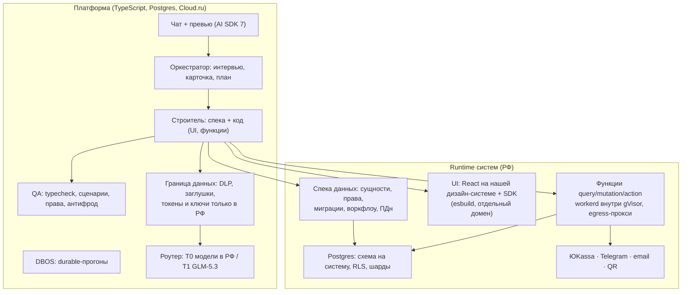

# Wizard: концепция v3 (после грилла-2, 30.09.2026)

Как собрана эта версия:

- **v1** — интервью по 16 развилкам.
- **v2** ([архив](concept-v2.md)) — аудит 34 допущений.
- **v3** — ревью основателя ([reviews/2026-09-30-founder-review-v2.md](reviews/2026-09-30-founder-review-v2.md)) и грилл-2 из 10 вопросов ([reviews/grill-2.md](reviews/grill-2.md)) на основе трёх исследований:
  - [ниши](research/niches-deep-dive.md);
  - [аудит VibeCraft](research/vibecraft-audit.md);
  - [граница данных и фронтир-модели](research/data-boundary-frontier.md).

## 1. Продукт и позиционирование

Wizard — **прямая альтернатива Яндекс VibeCraft** для нетехнических пользователей: не менее мощная, более гибкая и кастомизируемая, без привязки к Яндексу.

**Как это работает.** Пользователь описывает задачу в чате. Оркестратор задаёт вопросы с вариантами-кнопками и показывает карточку системы с ценой и потолком расходов. После этого агенты автономно собирают работающую систему: данные, права, интерфейс, логику и интеграции. Систему видно в живом превью рядом с чатом. Она проходит гейты качества, публикуется в российском облаке и дорабатывается тем же чатом.

**Не нишуемся.** Движок горизонтальный. Ивенты и товары на заказ — это **полигоны для обкатки**, а не позиционирование.

**Главное сообщение: четыре отличия от VibeCraft**, все входят в MVP.

| Отличие | Что получает пользователь | Что у VibeCraft (по аудиту) |
|---|---|---|
| **Надёжность** | Отчёт проверок перед публикацией, безопасные миграции живых данных, откат любой ревизии. Долгие сборки не теряются | Про миграции и тесты в документации ничего нет. Задача ограничена 30 минутами, работа теряется. Есть жалобы на выдуманные данные |
| **Интеграции из коробки** | ЮKassa, Telegram, email, QR-билеты и сканер | Интеграций нет, только в роадмапе |
| **Независимость от Яндекса** | Вход в систему по телефону, почте или Telegram уже на Free. Выбор моделей, хостинг вне Yandex Cloud, выгрузка данных | Только Яндекс ID и только на платном тарифе. Yandex Cloud, YDB |
| **Прозрачная цена и 152-ФЗ** | Цена сборки с потолком видна заранее (≈ 20 кредитов). Согласия, политика и автоудаление ПДн встроены в каждую систему | Сайт автосервиса съел 530 кредитов за 52 минуты. Помощи с 152-ФЗ нет |

**Не соревнуемся:**

- в трафике и бренде;
- в «сделать вообще что угодно»;
- в экспорте кода как продающей фиче;
- в жёстких SLA. Отложено на потом: совместное редактирование, свои домены, экспорт кода.

## 2. Полигоны: единое ядро

У ивентов и товаров на заказ один скелет. Он становится ядром библиотеки компонентов и SDK:

> **Каталог → Заявка → Процесс → Оплата → Выдача**

1. **Каталог** — позиции с опциями: типы билетов или варианты товара.
2. **Заявка или заказ** — с анкетой.
3. **Процесс** — статусы, модерация, квоты или остатки.
4. **Оплата.**
5. **Выдача** — QR-билет или отгрузка.

Вокруг этого — уведомления, кабинет участника или покупателя и отчёты.

Различия ниш задаются в спеке и коде:

- **ивенты** — расписание, зоны доступа, расселение, чек-ин;
- **заказы** — калькулятор изделия, прайс по контрагенту, предзаказ.

По разбору ниш, на полигоне ивентов Wizard выигрывает там, где у события своя структура данных: роли, модерация, квоты, расселение, зоны. Сейчас такое заказывают у разработчиков от ~100 тыс. ₽. Регистрация на событие — это всегда ПДн. Автоудаление данных после события — аргумент в продажах.

**Госсектор напрямую не берём:** нужны реестр ПО (ПП 1875 распространяется и на облако) и ЕСИА (~650 тыс. ₽). Вход туда возможен позже, через подрядчиков.

## 3. Архитектура

### 3.1 Граница спеки и кода (пересмотр решения №5)

**Спека владеет тем, где нужны гарантии:**

- сущности и поля, связи, индексы;
- роли и матрица прав: из неё генерируется RLS;
- миграции: diff ревизий, в prod только аддитивные, откат;
- воркфлоу;
- подключения коннекторов;
- разметка ПДн по категориям.

Агенты меняют спеку типизированными операциями с валидацией, CAS и ревизиями. Этот паттерн взят из nucex.

**Код даёт гибкость:**

- **UI** — настоящий React на нашей дизайн-системе. Блоки ядра — это библиотека компонентов для агента, а не жёсткий каталог.
- **Серверная логика** — функции `query`, `mutation` и `action` в стиле Convex поверх Postgres. Эскиз — в [аудите 04, T2](audit/04-tech-feasibility.md#t2-уроки-промптов-chef-про-convex).
- **Сборка** — esbuild. Превью работает на draft-поддомене, prod — на отдельном домене для систем.
- **Изоляция серверного кода:**
  1. статика в G0;
  2. workerd;
  3. gVisor-поды в отдельном пуле узлов;
  4. egress-прокси с allowlist, секреты на стороне хоста.

**Вкладка «Код»** в MVP доступна только для чтения. По умолчанию пользователь видит чат, систему и понятный diff: «добавлено поле», «изменён экран».

### 3.2 Runtime

Без изменений относительно v2 ([concept-v2 §3.2](concept-v2.md)):

- схема на систему, шарды ≤2 тыс. схем;
- `SET LOCAL`, простые RLS-политики;
- realtime через инвалидацию;
- PITR.

**Вход конечных пользователей** в созданные системы — по телефону, почте или Telegram. Без Яндекс ID.

### 3.3 Агентный движок

- **Стек:** AI SDK 7, свой UI. Chef используем как донора промптов и приёмов работы с контекстом.
- **Прогоны:** DBOS Transact.
- **Роли:** оркестратор (интервью, карточка, план); строитель, который пишет спеку и код; QA.
- **Гейты для кода:** typecheck, lint, сборка, сценарные тесты по критериям приёмки.
- **Лимиты:**
  - потолок кредитов на сборку из карточки;
  - thinking выключен в ходах с инструментами;
  - после 5 ошибок подряд — эскалация.

### 3.4 Модели и граница данных

| Уровень | Модели | Какие вызовы |
|---|---|---|
| **T0 — РФ, любые данные** | Kimi-K2.6, DeepSeek-V4-Pro, GLM-5.1, Qwen3-Coder-Next, GigaChat3.5 (Cloud.ru, только внутренний контур); резерв — Yandex с `x-data-logging-enabled: false` | runtime-ИИ внутри систем, импорт таблиц, поддержка на живых записях, интервью, если в нём найдены ПДн, режим «только РФ» |
| **T1 — фронтир, по умолчанию для сборки** | **GLM-5.3 (Z.ai, Сингапур; данные API не хранит и не обучается на них)**. Kimi K3 — после договора о запрете обучения | план, спека, код UI и функций, QA, аудит, **только после удаления ПДн** |
| **Выключено** | Anthropic, OpenAI, Google, xAI | их условия не допускают обслуживание РФ, и перепродажа через Cloud.ru этого не меняет |

**Правило границы.** Токенизированные или зашифрованные ПДн по 152-ФЗ остаются ПДн, поэтому наружу уходят только **одноразовые заглушки без таблицы соответствия**. Обратимые токены и шифрование (OpenBao, FPE FF1) работают только внутри РФ.

**Детектор ПДн:**

- регулярки;
- Natasha/Presidio с российскими распознавателями: имена, телефоны, email, адреса, паспорт, СНИЛС, ИНН, карты.

**Импорт таблицы:**

- наружу уходят схема и синтетические строки;
- реальные значения обрабатываются только в T0.

**Переключатель «только российский контур»** — для строгих клиентов.

**Неделя 0:**

- сравнительный eval GLM-5.1 (РФ) против GLM-5.3 на 30 брифах;
- запрос в Cloud.ru развернуть GLM-5.3 внутри РФ (веса открыты);
- вопрос об оплате Z.ai из РФ: платёжный агент или валютный контроль.

Детали — в [research/data-boundary-frontier.md](research/data-boundary-frontier.md).

### 3.5 Гейты качества

| Гейт | Что проверяет | Политика |
|---|---|---|
| G0 | Валидность спеки, аддитивность миграций, запросы по индексам, typecheck, lint, сборка, статический анализ кода функций | блокирует |
| G1 | Сценарные тесты по критериям приёмки из карточки на seed-данных | блокирует |
| G2 | Матрица прав; секреты; разметка ПДн; запрет спецкатегорий; **антифрод** — нет сбора карт, паролей и паспортов вне ЮKassa, нет имитации чужих брендов; нет ПДн в Telegram | блокирует |
| G3 | Playwright от лица ролей + VLM по скриншотам | блокирует только критичное, после MVP |
| G4 | Независимый аудитор из другого семейства моделей | блокирует только критичное, после MVP |

**Eval-стенд** обязателен при любой смене промпта или модели. Брифы — только без ПДн.

## 4. Злоупотребления и право

- **Антифрод:**
  - системы публикуются на **отдельном домене**, а не на домене платформы;
  - prod доступен только после привязки карты РФ — это одновременно идентификация клиента;
  - антифрод-правила в G2;
  - кнопка «Пожаловаться» и регламент снятия публикации за 24 часа.
- **Вопрос №1 для юриста на неделе 0** — статус по 149-ФЗ: хостинг-провайдер или SaaS.
- **152-ФЗ, 243-ФЗ, лицензии, налоги** — как в v2 ([concept-v2 §4](concept-v2.md), [аудит 03](audit/03-legal-and-licenses.md)). Плюс по новой архитектуре:
  - в ДПО перечислены субобработчики;
  - для T1 передаются только данные без ПДн;
  - формулировки оферты описывают использование фронтир-моделей.

## 5. Монетизация

| Тариф | Цена (за компанию) | Что входит |
|---|---|---|
| Free | 0 ₽ | **100 кредитов на первые 30 дней + 25 кредитов в месяц**, 1 система в prod после привязки карты |
| Старт | 1 990 ₽/мес | 50 кредитов, 2 системы, до 10 пользователей |
| Бизнес | 6 990 ₽/мес | 230 кредитов, 5 систем, до 30 пользователей |
| Докупка | 990 ₽ | 60 кредитов |

- 1 кредит ≈ 5 ₽ себестоимости LLM.
- Сборка ≈ 20 кредитов, с потолком из карточки. Себестоимость сборки на GLM-5.3 ≈ 50–75 ₽ (оценка).
- Главное сообщение: «система за ~20 кредитов, цена известна заранее».
- Партнёрства и канал интеграторов — после MVP.

## 6. План: 16 недель до закрытой беты

| Недели | Содержание |
|---|---|
| 0 (до старта) | Eval GLM-5.1 против GLM-5.3; вопросы в Cloud.ru; юрист (149-ФЗ, субпоручение, оферта); договор и оплата Z.ai; 5–8 дизайн-партнёров из ивент-заказов основателя и среди производителей на заказ |
| 1–3 | Аккаунты и организации; спека данных и операции; DDL, RLS, миграции, ревизии; runtime на Postgres; DBOS; роутер уровней T0/T1 |
| 4–6 | Кодогенерация: React на дизайн-системе + SDK, esbuild, draft-превью; функции в workerd + gVisor с egress-прокси; G0 и G1 |
| 7–9 | Оркестратор: интервью, карточка, план; строитель; библиотека ядра — каталог, анкета, таблица, карточка, доска статусов, QR-билет и сканер, кабинет, отчёт; вход по телефону, почте, Telegram |
| 10–12 | Коннекторы ЮKassa, Telegram, email; G2 и антифрод; граница данных: DLP, заглушки, импорт таблиц через синтетику; публикация в prod, аддитивные миграции, откат |
| 13–14 | Биллинг и кредиты, Free, юридический пакет, пакет 152-ФЗ для систем (согласия, автоудаление) |
| 15–16 | Закрытая бета на обоих полигонах, ревью основателя перед prod, eval-стенд на 30 брифов |
| ~20 | Публичный запуск |

## 7. Риски

| Риск | Митигация |
|---|---|
| Качество кода на открытых и фронтир-моделях | Спека держит данные и права, гейты G0–G2, eval-стенд; GLM-5.3 по умолчанию для сборки |
| Z.ai: условия, оплата из РФ, доступность | Роутер переключается на T0 без изменения кода; запрос в Cloud.ru на внутренний GLM-5.3; Kimi K3 как второй T1 |
| VibeCraft: трафик, бренд, бесплатный уровень | Четыре отличия в MVP, Free 100 + 25 кредитов, прозрачная цена |
| Фишинг на бесплатном prod | Отдельный домен, карта, антифрод в G2, снятие за 24 ч |
| Статус по 149-ФЗ | Юрист на неделе 0 |
| Соло-основатель, 16 недель | Единое ядро, один строитель, DBOS, ревью основателя в бете |
| Безопасность кода пользователей | workerd + gVisor, egress-прокси, статика в G0 |

## 8. Открытые вопросы на следующий раунд

1. Дизайн-партнёры: кто конкретно, по 3 брифа от каждого, сроки.
2. Бренд и название: «Wizard» — рабочее имя, нужна проверка ТЗ и домена.
3. Дизайн-система созданных систем: насколько кастомизируется внешний вид (темы или полный контроль через код).
4. Мобильные сценарии: PWA для сканера QR и кабинетов или нативные приложения позже.
5. Совместная работа: несколько редакторов в одной системе — когда.
6. AI-функции внутри созданных систем (runtime-ИИ на T0): входят ли в MVP.

## Журнал решений

| # | Развилка | v2 | v3 |
|---|---|---|---|
| 1 | Сегмент и позиционирование | SMB, ниша «ремонт» | **Горизонтальная альтернатива VibeCraft** для нетехнических пользователей |
| 2 | Форма системы | Спека + код в точках расширения | **Спека для данных, код для UI и логики** |
| 3 | LLM | Только модели в РФ | **T0 в РФ + T1 GLM-5.3 по умолчанию для сборки** с границей данных |
| 4 | Runtime | Postgres + workerd в gVisor | без изменений |
| 5 | Фронтенд | 8 блоков каталога | **React-код на дизайн-системе**, блоки ядра — библиотека компонентов |
| 6 | Интеграции | amoCRM №1 | **ЮKassa, Telegram, email, QR**; amoCRM — после MVP |
| 7 | Автономия | Один чекпоинт | без изменений |
| 8 | Гейты | G0–G2 | + typecheck и тесты кода, антифрод в G2 |
| 9 | Хостинг | Поддомены | Отдельный домен для систем, карта перед prod |
| 10 | Монетизация | Free 25 кредитов | **Free 100 + 25 в месяц**; 1 990 / 6 990 ₽ приняты |
| 11 | Команда | Соло | без изменений |
| 12 | Вертикаль | Ремонт | **Полигоны: B2B-ивенты и товары на заказ**, единое ядро |
| 13 | Движок | DBOS, один строитель | + строитель пишет код |
| 14 | Объём и срок | Бета на 6-м месяце | **Бета на 16-й неделе без нарезок**, публичный запуск ~20-я неделя |
| 15 | GTM | Партнёры + интеграторы | Дизайн-партнёры; интеграторы после MVP |
| 16 | Облако | Cloud.ru + Yandex | + Z.ai как T1 |
| 17 | Код для пользователя | — | Скрыт; «Код» только для чтения |
| 18 | Антифрод | — | Отдельный домен, карта, G2, снятие за 24 ч |
