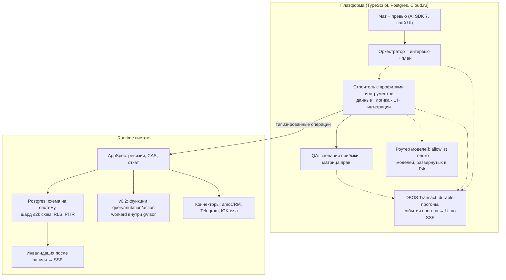

# Wizard: концепция v2 (после аудита, 30.09.2026)

Версия 1 была собрана в интервью (16 развилок). Версия 2 учитывает аудит допущений по открытым источникам: [модели и экономика](audit/01-llm-access-and-costs.md), [спрос и конкуренты](audit/02-demand-and-competition.md), [право и лицензии](audit/03-legal-and-licenses.md), [техническая реализуемость](audit/04-tech-feasibility.md). Сводка — в [audit/README.md](audit/README.md).

Изменения, которые **ждут подтверждения основателя**, помечены **[на решение]**. Они собраны в разделе 11.

## 1. Продукт и позиционирование

Wizard — российский сервис, в котором небольшая компания описывает в чате, как у неё устроена работа. Агент-оркестратор задаёт 3–7 вопросов с вариантами-кнопками и показывает **карточку системы**: роли, сущности, экраны, интеграции, критерии приёмки и цену. После нажатия «Строить» агенты собирают систему автономно. Пользователь видит её в живом превью рядом с чатом. Система проходит гейты качества и публикуется в российском облаке. Дорабатывается она тем же чатом.

**Позиционирование [на решение]:**

> Для небольших компаний заказных и выездных услуг, у которых заказ после сделки живёт в таблицах и чатах, Wizard по описанию собирает операционную систему заказа: смета → этапы → бригады → фотоотчёты → оплаты частями → уведомления клиенту. Система связана с amoCRM, данные хранятся в РФ. В отличие от Яндекс VibeCraft, Wizard не выдаёт «код на доработку»: права, миграции и интеграции проверены, и систему можно безопасно менять чатом. В отличие от Битрикс24 Вайбкод, Wizard не требует переезда в экосистему.

**Конкуренты** (подробно в [аудите 02](audit/02-demand-and-competition.md#d4-российские-ai-конструкторы-сентябрь-2026)). Тезис «прямого аналога в РФ нет» опровергнут.

- **Яндекс VibeCraft** — публичный с июня 2026. Уточняющие вопросы, CRM и трекеры, встроенная БД, хостинг в Yandex Cloud, бесплатный уровень. Статус Preview, без SLA, «код может потребовать доработки».
- **Битрикс24 Вайбкод** — приложения внутри портала Битрикс24, с сентября 2026 есть биржа студий.
- **amoCRM «Амма»** — AI-агент, который делает виджеты внутри amoCRM.

Отличие Wizard строится не на самом факте «чат + превью», а на трёх вещах: надёжности в проде (спека, гейты, безопасные миграции), глубине одной ниши и интеграции с amoCRM.

## 2. Кто пользователь

- **Сегмент:** малый бизнес с 3–30 сотрудниками и нестандартным процессом «после сделки».
- **Стартовая ниша (MVP) [на решение]:** ремонт и отделка квартир под ключ. Следом идут соседние ниши на том же каталоге блоков: мебель на заказ, монтаж окон и кондиционеров, B2B-клининг.
  - **Почему не салоны и студии (решение №12 v1):** запись на услуги закрыта бесплатными и дешёвыми вертикальными SaaS с маркетплейсами (DIKIDI, YCLIENTS).
  - **Почему ремонт:** по данным одного вендора CRM, ремонт лидирует по внедрениям CRM. Процессы там разные, шаблоны подходят плохо, а продажи часто ведут в amoCRM, пока исполнение живёт в Excel и Telegram.
- **Второй канал:** интеграторы amoCRM. Им Wizard служит инструментом для сборки операционных систем их клиентам.

## 3. Архитектура

### 3.1 Система = спека + код

Ядро — **AppSpec**, JSON со строгой zod-схемой. Эта схема одновременно служит определением инструментов агента, серверным валидатором и основой UI-редактора. Паттерн взят из nucex.

- `entities[]` — поля, связи, индексы, **категория ПДн** (обычные / специальные / биометрия).
- `roles[]` — роли и матрица прав.
- `pages[]` — экраны из блоков каталога.
- `workflows[]` — триггер → действия.
- `integrations[]` — подключения коннекторов с ссылками на секреты.
- `functions[]` — v0.2.
- `components[]` — v0.3.
- `acceptance[]` — критерии приёмки.

Агенты не переписывают спеку целиком, а применяют типизированные операции. Каждая операция проверяется, ошибка возвращается структурно (путь, код, допустимые значения). Изменения защищены `expectedVersion` (CAS) и идемпотентны, каждая ревизия записывается, откат — в один клик.

### 3.2 Runtime на Postgres

- **Схема на систему.** Таблица «система → кластер» заводится с первого дня, на кластер не больше ~1,5–2 тыс. схем. Черновики Free живут в отдельном кластере с TTL. Бэкапы — через снапшоты и PITR провайдера, а не через `pg_dump`.
- **PgBouncer в режиме transaction:**
  - в запросах всегда полностью квалифицированные имена;
  - контекст пользователя передаётся только через `set_config(..., true)` внутри транзакции, потому что сессионный `SET` протекает между тенантами;
  - RLS-политики простые, членство хранится в денормализованных таблицах. RLS — второй рубеж, первый — построитель запросов runtime.
- **Realtime.** После записи runtime публикует событие инвалидации «система, сущность, id» в pub/sub. Клиент получает его по SSE и перезапрашивает данные. LISTEN/NOTIFY и WAL в v0.1 не используются: LISTEN/NOTIFY берёт глобальную блокировку на коммите.
- **Миграции.** Diff ревизий превращается в типизированные операции, те — в DDL через Kysely с `lock_timeout`. В prod v0.1 разрешены только **аддитивные** миграции. Разрушающие изменения появятся позже по схеме expand/contract.
- **Публикация в v0.1** — на поддомене `*.wizard.site`. Свои домены — в v0.2.
- **Кастомный код (v0.2)** — в стиле Convex: `query`, `mutation`, `action` с валидаторами (эскиз SDK в [аудите 04, T2](audit/04-tech-feasibility.md#t2-уроки-промптов-chef-про-convex)). Защита слоями:
  1. статические проверки в G0;
  2. workerd;
  3. **gVisor-поды в отдельном пуле узлов**;
  4. egress-прокси с allowlist, секреты на стороне хоста.

  README workerd прямо говорит, что это не песочница для чужого кода.

### 3.3 Фронтенд созданных систем

Страницы собираются из каталога блоков в единой дизайн-системе с темами. Правка спеки сразу видна в превью.

**Каталог v0.1 (8 блоков, под нишу):** таблица, форма (со ссылкой на политику и отдельным согласием на ПДн), карточка, канбан, **смета**, **этапы с оплатами**, **фотоотчёт**, простой дашборд.

Календарь и онлайн-запись — v0.2. Кастомные React-блоки в iframe-песочнице — v0.3.

### 3.4 Агентный движок

- **Chef — донор промптов, а не кода.** Цикл агента у Chef работает в браузере через WebContainer, AI SDK версии 4, и переносится только 10–15% кода. Берём из него:
  - структуру промптов;
  - свёртку истории под кэш;
  - карточки вызовов инструментов;
  - откат (rewind).

  UI пишем свой на AI SDK 7 с атрибуцией Apache-2.0 и MIT (bolt.diy).
- **Прогоны серверные и durable на DBOS Transact** (MIT, поверх того же Postgres). pg-boss — только очередь, чекпоинтов в нём нет. Каждый LLM-шаг — это шаг воркфлоу. UI читает события прогона по SSE, поэтому закрытая вкладка сборку не останавливает.
- **Роли в v0.1:**
  - оркестратор: интервью и план;
  - **один строитель** с профилями инструментов (данные, логика, UI, интеграции);
  - QA-агент.

  Агент-интегратор с поиском документации — v0.2. Он работает через отложенный Yandex Search (30,5 ₽ за 1 тыс. запросов) и собственный индекс документации.
- **Политика вызовов:**
  - thinking выключен в ходах с инструментами;
  - рассуждение — отдельным вызовом без инструментов;
  - structured output не используется: только инструменты с zod-схемами, серверная валидация и цикл исправления;
  - контрактные тесты на каждую пару «провайдер × модель».
- **Лимиты:**
  - ledger вызовов, дедлайн;
  - **потолок кредитов на сборку** из карточки;
  - после 5 ошибок подряд инструменты отключаются и задача эскалируется.

### 3.5 Модели

Используются только модели, **развёрнутые в РФ** (внутренний контур Cloud.ru). Роутер проверяет флаг внутренней или внешней модели по каталогу.

| Роль | Модель | Цена за 1M токенов, вход/выход, ₽ с НДС |
|---|---|---|
| Оркестратор | Kimi-K2.6 | 176 / 726 |
| Строитель | DeepSeek-V4-Pro или GLM-5.1 (решает eval) | 183 / 732 · 199 / 830 |
| Дешёвые шаги | Qwen3-Coder-Next, gpt-oss-120b | 122 / 244 · 16 / 61 |
| Аудитор (другое семейство) | GigaChat3.5 или GLM-5.1 | 96 / 289 |
| Резерв | Yandex: Qwen3-235B / DeepSeek-V4-Flash, заголовок `x-data-logging-enabled: false` | 500 / 500 · 300 / 500 |

**Запрещено для данных с ПДн:** внешние модели Cloud.ru (GLM-5.2, DeepSeek-V4-Flash в Cloud.ru, Claude, GPT, Gemini), потому что данные уходят за рубеж.

**Потолок качества.** Внутри РФ доступны модели уровня Opus 4.6 (февраль 2026), то есть отставание от фронтира — 2+ поколения. Компенсируется узкой спекой и eval-стендом.

**Эскалация на Claude или GPT через внешние модели Cloud.ru [на решение]:** рекомендую не включать в v0.1. Если включать, то только по явному согласию пользователя, только для задач без ПДн и с пометкой «данные уходят за рубеж».

### 3.6 Гейты качества

| Гейт | Что проверяет | Политика |
|---|---|---|
| G0 | Валидность спеки, аддитивность миграций, запросы только по индексам; для кода — статика, typecheck, сборка | блокирует |
| G1 | Критерии приёмки на seed-данных (в v0.1 — проверки по данным, без генерации тестов агентом) | блокирует |
| G2 | Матрица прав «роль × сущность × операция», отсутствие секретов, разметка ПДн, **запрет спецкатегорий и биометрии**, нет ПДн в текстах Telegram | блокирует |
| G3 (v0.3) | Playwright от лица каждой роли + VLM | только критичное |
| G4 (v0.3) | Независимый аудитор из другого семейства моделей | только критичное |

**Eval-стенд.** Прогоняется при каждой смене промпта или модели. Брифы берутся только без ПДн или обезличенные. На стенде меряем:

- долю систем, прошедших G0–G2 без человека;
- токены и рубли на одну сборку;
- время до первого превью.

### 3.7 Интеграции

- **v0.1:**
  - **amoCRM** — коннектор №1: выигранная сделка создаёт объект, статусы объекта возвращаются в сделку, OAuth;
  - **Telegram** — уведомления **без ПДн**, вида «Новый этап по объекту №123» + ссылка;
  - **ЮKassa** — счета клиентам только через **магазин самой компании**, Wizard чужие деньги не принимает;
  - email как канал уведомлений.
- **v0.2:** Т-Банк, SMS, Дадата, Bitrix24, МойСклад, 1С, генерируемые коннекторы.
- **Секреты** вводятся в защищённую форму, модель видит только ссылку на секрет.
- **Чат-виджет убран из v0.1:** он создаёт риск статуса организатора распространения информации (ОРИ) по 149-ФЗ.

## 4. Право и соответствие требованиям

Подробно — в [аудите 03](audit/03-legal-and-licenses.md). Это не юридическое заключение, окончательные решения принимает юрист.

- **152-ФЗ.** Для своих пользователей Wizard — оператор ПДн. Для данных внутри систем клиентов — обработчик по поручению. Что нужно:
  - ДПО с перечнем субобработчиков (Cloud.ru, Yandex);
  - договоры-поручения с облаками;
  - отдельное согласие на обработку ПДн: с 01.09.2025 его нельзя вшивать в оферту;
  - уведомление РКН, модель угроз, ОРД. Уровень защищённости УЗ-4 для платформы, УЗ-3 для runtime;
  - регламент инцидентов 24/72 ч.
- **С 01.07.2025 ПДн нельзя хранить в зарубежных БД** в принципе. Значит, никаких Sentry, почты или аналитики с ПДн за рубежом.
- **149-ФЗ — главный открытый юридический вопрос.** Хостинг систем клиентов может сделать Wizard **провайдером хостинга**: уведомление РКН, идентификация клиентов до prod, требования к ОРМ. Это вопрос №1 для юриста. До ответа идентифицируем клиента через оплату картой РФ перед публикацией в prod.
- **243-ФЗ об ИИ.** Ключевые нормы вступают 01.03.2027. GLM, Kimi и DeepSeek — не «национальные» модели. Для клиентов, которым это понадобится, позже добавим режим «только российские модели» (GigaChat). В оферте нужен пункт о правах на результат (ст. 10).
- **Лицензии:**
  - Convex backend — FSL, код не копируем, повторяем только стиль API;
  - Chef — Apache-2.0 плюс MIT от bolt.diy, нужна атрибуция;
  - WebContainers не используем;
  - в репозитории нужен `THIRD_PARTY_NOTICES`.
- **Налоги.** Тариф разделить на «лицензию» и «хостинг» (проверить с налоговым консультантом). Реестр отечественного ПО — в v0.2–v0.3.

## 5. Монетизация [на решение]

Цена берётся **за компанию**, а не за пользователя. 1 кредит ≈ 5 ₽ себестоимости LLM. Сборка ≈ 20 кредитов с потолком из карточки, правка — 3–6 кредитов.

| Тариф | Цена | Что входит |
|---|---|---|
| Free | 0 ₽ | 25 кредитов один раз; 1 система в prod с лимитами (5 пользователей, 1 000 записей) после привязки карты |
| Старт | 1 990 ₽/мес | 50 кредитов/мес, 2 системы, до 10 пользователей |
| Бизнес | 6 990 ₽/мес | 230 кредитов/мес, 5 систем, до 30 пользователей, приоритетная сборка |
| Докупка | 990 ₽ | 60 кредитов |
| Агентство | v0.2 | мультиклиентность, white-label |

- **Себестоимость сборки** — от 46 до 96 ₽ в среднем (оценка). Стресс-сценарий, 1–1,5 млн токенов, даёт до 300–500 ₽. Главную неизвестную меряем первым прогоном.
- **Маржа.** «Бизнес» даёт маржу ≥70% с запасом. «Старт» рассчитан на правки: 1–2 сборки в месяц.
- **НДС.** На ОСН маржа «Старта» падает ниже 70%, это решается структурой «лицензия + хостинг».

## 6. План

Оценка v0.1 в исходном объёме — 145–180 человеко-дней при ~65 доступных. К этому добавляются 25–35 дней юридической работы. Поэтому объём сокращён, а срок закрытой беты сдвинут.

| Этап | Срок | Содержание |
|---|---|---|
| Неделя 0 | 1–2 недели | Проверки из раздела 10 |
| **v0.1, закрытая бета** | **мес. 1–6** | Чат, вопросы, карточка; AppSpec + runtime; 8 блоков ниши; amoCRM, Telegram, ЮKassa; G0–G2; eval-стенд (30 брифов); draft/prod на поддомене; оплата; юридический пакет |
| v0.2 | мес. 7–9 | Функции в workerd+gVisor, агент-интегратор, календарь и запись, свои домены, тариф «Агентство», новые ниши |
| v0.3 | мес. 10–12 | Кастомные React-блоки, G3–G4, экспорт, реестр ПО |

**Порядок работ в v0.1:**

1. **Мес. 1:** юрист, договоры с облаками, уведомление РКН; AppSpec и операции; DDL/RLS/CRUD; каркас DBOS.
2. **Мес. 2:** чат, события прогона, превью; оркестратор и строитель на операциях; G0; первые 10 брифов.
3. **Мес. 3:** блоки таблица, форма, карточка, канбан; миграции draft/prod; G1.
4. **Мес. 4:** смета, этапы с оплатами, фотоотчёт, дашборд; amoCRM.
5. **Мес. 5:** Telegram, ЮKassa, G2, биллинг, пакет 152-ФЗ для клиента.
6. **Мес. 6:** бета с 5–8 дизайн-партнёрами, eval-стенд на 30 брифов.

## 7. GTM

- **Дизайн-партнёры** из ниши ремонта, 5–8 компаний. Бесплатный год в обмен на обезличенные брифы и обратную связь.
- **Интеграторы amoCRM** — параллельно, с первого месяца. Одна сделка с ними даёт десятки клиентов.
- **Публичная разработка** в Telegram и на vc.ru, демо «операционка ремонта за 15 минут».

## 8. Риски

| Риск | Митигация |
|---|---|
| Яндекс VibeCraft: трафик, бесплатный уровень, бренд | Ниша, контур amoCRM, гейты и безопасные миграции, ДПО и 152-ФЗ, бесплатный уровень |
| Потолок качества моделей в РФ (уровень Opus 4.6) | Узкая спека вместо свободного кода, eval-стенд, строгие гейты |
| Каталог Cloud.ru сокращается без компенсации по SLA | Роутер на 2+ модели каждой роли, резерв в Yandex, позже выделенный инстанс или vLLM |
| Токен-профиль сборки в 3–5 раз выше оценки | Потолок кредитов на сборку, свёртка контекста, замер на неделе 0 |
| Статус провайдера хостинга и ОРИ по 149-ФЗ | Юрист в мес. 1, идентификация перед prod, без чат-виджета |
| Соло-основатель, объём ×2,5 | Сокращённый v0.1, бета в мес. 6, интеграторы как канал |
| Мультитенантная безопасность | RLS + построитель запросов + G2, `SET LOCAL`, шардирование, для кода — gVisor |

## 9. Что уже проверено аудитом

Проверено 34 допущения:

| Вердикт | Число |
|---|---|
| Подтверждено | 9 |
| Частично | 18 |
| Опровергнуто | 4 |
| Не удалось проверить | 1 |
| Новый риск / не применимо | 2 |

Все опровергнутые пункты учтены выше:

- «аналога в РФ нет»;
- «рынок AI-конструкторов пуст»;
- «workerd достаточно для изоляции»;
- «v0.1 за 4 месяца».

Отдельно: допущение «открытые модели отстают на одно поколение» подтвердилось лишь частично. Для моделей, доступных в РФ, отставание — 2+ поколения.

## 10. Неделя 0: что нельзя проверить по открытым источникам

1. **Cloud.ru, вопросы в поддержку:**
   - TPM-лимиты;
   - строгость `json_schema`;
   - кэш-скидки на внутренних моделях;
   - `wal_level` и пулер в Managed PostgreSQL;
   - лимиты числа схем;
   - gVisor или вложенная виртуализация в Managed Kubernetes;
   - копия аттестата УЗ-1 с границами (входят ли PG, K8s, FM).
2. **Прототип «бриф → AppSpec».** 10 брифов ремонта на Kimi-K2.6, V4-Pro и GLM-5.1. Замерить валидность спеки, итерации, токены и рубли.
3. **Юрист** (50–150 тыс. ₽): хостинг-провайдер или SaaS; ОРИ; субпоручение LLM; «лицензия + хостинг» для НДС.
4. **Спрос:**
   - Wordstat по нише;
   - лендинг + Директ на 20–30 тыс. ₽ с замером цены заявки;
   - 3–5 звонков интеграторам amoCRM;
   - минимум 3 интервью с владельцами ремонтных компаний.

## 11. Решения для основателя

| # | Вопрос | Рекомендация |
|---|---|---|
| 1 | Сменить стартовую нишу с «салоны, студии» на «ремонт и отделка» | Да |
| 2 | Срок закрытой беты: мес. 6 с сокращённым объёмом (или мес. 4 при ещё более узком объёме: без amoCRM и фотоотчёта) | Мес. 6 |
| 3 | Разрешить опциональную эскалацию на Claude/GPT через внешние модели Cloud.ru (без ПДн) | Не в v0.1 |
| 4 | Free с одной системой в prod после привязки карты | Да |
| 5 | Тарифы 1 990 / 6 990 ₽ за компанию, кредиты 50 / 230 | Да, пересмотреть после замера на неделе 0 |
| 6 | Канал интеграторов amoCRM с первого месяца | Да |

## Журнал решений

| # | Развилка | v1 (интервью) | v2 (после аудита) |
|---|---|---|---|
| 1 | Сегмент | SMB и внутренние инструменты | без изменений |
| 2 | Форма системы | Спека + код | без изменений (подтверждено nucex и Chef) |
| 3 | LLM | Открытые модели в РФ + роутер | + allowlist только внутренних моделей, thinking выключен в ходах с инструментами |
| 4 | Runtime | Postgres + V8-изоляты | + шарды ≤2k схем, инвалидация вместо LISTEN/NOTIFY, **workerd внутри gVisor** |
| 5 | Фронтенд | Каталог + кастомный React | каталог v0.1 = 8 блоков ниши |
| 6 | Интеграции | Курируемые + генерируемые | v0.1: amoCRM №1, Telegram без ПДн, ЮKassa клиента; генерируемые — v0.2 |
| 7 | Автономия | Один чекпоинт: карточка | без изменений |
| 8 | Гейты | G0–G2 блокируют | + запрет спецкатегорий ПДн, G1 без генерации тестов в v0.1 |
| 9 | Хостинг | Управляемый, draft/prod, экспорт | поддомены в v0.1, в prod только аддитивные миграции, идентификация перед prod |
| 10 | Монетизация | Подписка + кредиты | цена за компанию, 1 кредит ≈ 5 ₽, Free с prod, «Агентство» в v0.2 |
| 11 | Команда | Соло | без изменений, бета сдвинута на мес. 6 |
| 12 | Вертикаль | Сервисный бизнес: запись, CRM | **ремонт и отделка** (заказные услуги) [на решение] |
| 13 | Движок | AI SDK + pg-boss, Chef как донор UI | **DBOS Transact**; Chef — донор промптов; один строитель с профилями |
| 14 | Объём MVP | v0.1 / v0.2 / v0.3 | v0.1 сокращён: 8 блоков, 3 коннектора, поддомены |
| 15 | GTM | Партнёры + публичная разработка | + интеграторы amoCRM с первого месяца |
| 16 | Облако | Cloud.ru + Yandex | без изменений; у Yandex логирование выключено заголовком |
