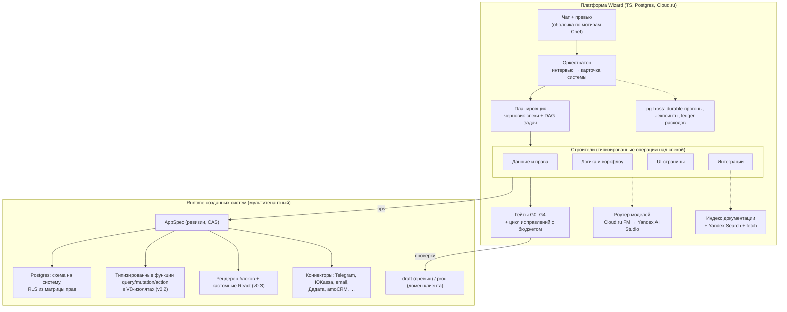

# Wizard: концепция, архитектура и план (версия 1, 30.09.2026)

Документ фиксирует картину, собранную в интервью (grill-me) по 16 развилкам. Каждое решение ниже принято явно, альтернативы и причины записаны в [журнале решений](#журнал-решений). Исследования: [рынок и технологии](research/market.md), [разбор «Чистого листа» в nucex](research/nucex-clean-slate.md).

## 1. Продукт в одном абзаце

Wizard — российский SaaS, в котором владелец малого бизнеса пишет в чат, что ему нужно («CRM для студии растяжки с записью, оплатой и напоминаниями в Telegram»). Агент-оркестратор задаёт 3–7 уточняющих вопросов кнопками и показывает **карточку системы**: роли, сущности, экраны, интеграции, критерии приёмки и цену в кредитах. После «Строить» команда агентов автономно собирает систему, а пользователь видит её в живом превью под чатом. Готовая система проходит гейты качества и публикуется на домене клиента в российском облаке. Дальше её дорабатывают тем же чатом.

**Позиционирование:** «Lovable для малого бизнеса в России». Рубли, 152-ФЗ, российские интеграции, работа без VPN. Прямого аналога для нетехнических пользователей в РФ нет. Ближайший, Битрикс24 Вайбкод, заперт в экосистеме Битрикс24.

## 2. Кто пользователь и что он строит

- **Сегмент:** SMB и внутренние инструменты.
- **Стартовая вертикаль (MVP):** сервисный бизнес, то есть салоны, студии, ремонт, агентства и обучение. Типовые системы: клиенты, заявки и статусы, запись и расписание, оплаты, уведомления, отчёты.
- **Типичный путь пользователя:** переход с Google-таблиц и тетради на свою систему.

Движок с первого дня универсальный. Вертикаль задаёт только стартовый каталог блоков, коннекторов, вопросов и золотой набор брифов.

## 3. Архитектура



### 3.1 Система = спека + код (гибрид)

Ядро системы — декларативная **AppSpec**, JSON со строгой zod-схемой. Эта же схема служит определением инструментов агента, серверным валидатором и основой UI-редактора. Паттерн взят из «Чистого листа» nucex, где он дал 39 успехов из 40 на дешёвой модели.

```
AppSpec
├─ entities[]      поля, типы, связи, индексы, пометка ПДн (152-ФЗ)
├─ roles[]         роли и матрица прав «роль × сущность × операция» (+ условия по строкам)
├─ pages[]         страницы из блоков каталога: table, form, kanban, card, calendar,
│                  dashboard, chart, booking-widget, public-landing, chat-widget
├─ workflows[]     триггер (событие, расписание, вебхук) → действия (обновить, уведомить,
│                  вызвать коннектор, вызвать функцию)
├─ integrations[]  экземпляры коннекторов + ссылки на секреты (сами секреты модель не видит)
├─ functions[]     (v0.2) кастомная логика: query / mutation / action с валидаторами
├─ components[]    (v0.3) кастомные React-блоки с доступом к данным только через SDK
└─ acceptance[]    критерии приёмки из карточки системы, на них опираются тесты G1
```

**Правила работы со спекой** (все из nucex):

- Агенты не переписывают спеку целиком, а применяют **типизированные операции**: `add_entity`, `update_field`, `add_page_block`, `set_permission` и т. д.
- Каждая операция проверяется сразу. Ошибка возвращается структурированно: путь, код и допустимые значения. После двух ошибок подряд задача уходит на эскалацию.
- `expectedVersion` (CAS), идемпотентность, ревизии с автором и `agent_turn_id`, откат в один клик.
- Числа и данные в ответах агента берутся только от сервера.

### 3.2 Runtime на Postgres

- Один кластер (управляемый Postgres в Cloud.ru), у каждой системы своя схема. На росте крупные системы переезжают в отдельную БД.
- Из спеки генерируются DDL, RLS-политики, CRUD и realtime-API. **Миграция** — это diff двух ревизий спеки. Разрушающие изменения (удаление поля, смена типа) требуют плана миграции данных и явного подтверждения.
- **Кастомная логика (v0.2)** пишется в стиле Convex: `query`, `mutation` и `action` с валидаторами аргументов. Исполняется в V8-изолятах (workerd, Apache-2) с лимитами CPU и памяти и egress-allowlist. Так модель получает те же жёсткие рельсы, что даёт Chef на Convex, но без лицензионного риска FSL.
- **Окружения:** `draft` — это превью под чатом на seed-данных или маскированном срезе, `prod` — боевая версия. Публикация идёт через diff-превью, миграцию и возможность отката.
- **Экспорт** (v0.3): дамп Postgres, спека, код функций и движок runtime. Это гарантия отсутствия lock-in.

### 3.3 Фронтенд созданных систем

- Страницы рендерит наш движок из каталога блоков в единой дизайн-системе с темами (цвета, логотип, шрифт из карточки).
- Правка спеки мгновенно отражается в превью без пересборки.
- **v0.3:** нестандартные блоки агент пишет как React-компоненты. Их собирает esbuild, затем они загружаются в sandboxed iframe, а данные получают только через SDK с учётом прав роли.

### 3.4 Агентный движок

- **Стек:** TypeScript + Vercel AI SDK, свой тонкий цикл. Длинные прогоны живут в очереди **pg-boss** с чекпоинтами. Платформа, runtime и очередь используют одну БД.
- **Chef (Apache-2) — донор, а не основа.** Из него берём оболочку «чат + превью», стриминг хода, приёмы системных промптов и работы с контекстом. WebContainers и Convex Cloud не берём.
- **Роли агентов:**
  - **Оркестратор** ведёт диалог. Анализирует цели, ограничения и декомпозицию. Выбирает развилки из таксономии вертикали по принципу «спрашиваем только то, что нельзя взять по умолчанию»: 3–7 вопросов, у каждого 2–4 варианта и помеченный рекомендуемый. Собирает карточку системы.
  - **Планировщик** строит черновик AppSpec и DAG задач для строителей.
  - **Строители:** данные и права, логика и воркфлоу, UI, интеграции. Каждый работает в узком профиле инструментов. Идея из nucex: у каждого профиля свой набор инструментов, а ID системы подставляет runtime.
  - **Интегратор** (v0.2) ищет документацию: собственный индекс (OpenAPI, llms.txt, документация npm), Yandex Search API и fetch. Пишет коннектор и проверяет его тестовыми вызовами.
  - **QA-агенты:** автор сценарных тестов (G1) и независимый аудитор (G4) из другого семейства моделей.
- **Лимиты хода:** ledger вызовов, дедлайн, бюджет в кредитах на систему и на итерацию. Перед каждым шагом проверяются флаги и владение прогоном. Все шаги пишутся в `llm_usage_events`.
- **Эскалация:** N попыток исправления → более сильная модель → вопрос пользователю кнопками.

### 3.5 Модели

| Роль | Основная | Резерв |
|---|---|---|
| Оркестратор, планировщик | GLM-5.x или Kimi K2.6 (Cloud.ru FM) | Qwen3-235B (Yandex AI Studio) |
| Строители (операции над спекой) | DeepSeek V4 или GLM-5.x | Qwen3-235B |
| Код функций и коннекторов (v0.2) | GLM-5.x / Kimi K2.6 | DeepSeek V4 |
| Аудитор G4 | модель **другого** семейства, чем у строителя | — |

Итоговое распределение определяет **eval-стенд**, а не бенчмарки. Роутер (OpenAI-совместимый интерфейс) позволяет менять модели без изменения кода.

Западные модели через реселлеров не используются: это нарушает условия поставщиков, грозит внезапным отключением, трансграничной передачей данных и закрывает продажи крупным клиентам. Возможное будущее расширение — BYOK: пользователь сам подключает свой ключ и сам за него отвечает.

### 3.6 Гейты качества

| Гейт | Что проверяет | Политика |
|---|---|---|
| G0 | Валидация спеки, безопасность миграций, typecheck/lint/сборка кода | блокирует |
| G1 | Сценарные тесты по критериям приёмки на seed-данных | блокирует |
| G2 | Автотест матрицы прав «роль × сущность × операция», egress-allowlist, поиск секретов, разметка ПДн | блокирует |
| G3 (v0.3) | Playwright-обход превью от лица каждой роли + VLM-оценка скриншотов | блокирует только на критичных находках |
| G4 (v0.3) | Независимый LLM-аудитор сверяет систему с карточкой | блокирует только на критичных находках |

По итогам прогона пользователь получает **отчёт аудита**.

**Качество самой платформы** проверяет eval-стенд: золотой набор брифов (20 → 50 → 100, ядро — реальные задачи дизайн-партнёров). Прогон обязателен при любой смене промпта, модели или каталога. Метрики:

- доля систем, прошедших G0–G2 без участия человека;
- время до первого превью;
- стоимость сборки в ₽;
- число вопросов в интервью.

### 3.7 Интеграции

- **Курируемые коннекторы:** типизированный SDK, OAuth или ключи в хранилище секретов, контрактные тесты.
  - v0.1: Telegram, ЮKassa, email, Дадата, amoCRM.
  - Дальше: Т-Банк, SMS, Bitrix24, МойСклад, 1С (OData), СДЭК, WB/Ozon.
- **Генерируемые коннекторы (v0.2):** агент-интегратор пишет их в том же формате. После ревью и тестов успешные коннекторы попадают в общую библиотеку. Эта библиотека со временем становится защитным рвом (moat).
- **Секреты** пользователь вводит в защищённую форму. Модель видит только ссылку на секрет.

## 4. Инфраструктура и соответствие требованиям

- **Cloud.ru Evolution:** Foundation Models, управляемый Postgres, Kubernetes, аттестация по 152-ФЗ.
- **Yandex Cloud:** резервный провайдер моделей и Search API.
- **Без Cloudflare, Vercel и Netlify:** частичные блокировки в РФ.
- **152-ФЗ:** платформа — оператор ПДн своих пользователей и обработчик ПДн в системах клиентов (нужен договор-поручение, ДПО). Нужны уведомление в РКН, хранение в РФ, разметка ПДн в спеке, маскирование в draft и логах, запрет передачи ПДн в модели за рубежом.
- **Платежи:** ЮKassa или Т-Банк, для юрлиц — оплата по счёту.
- **243-ФЗ об ИИ** (в силе с 01.09.2026): работа на открытых моделях в РФ — плюс для будущих продаж крупному бизнесу.

## 5. Монетизация

Подписка в рублях, в каждый тариф входят кредиты сборки и хостинг N опубликованных систем.

| Тариф | Ориентир | Что входит |
|---|---|---|
| Free | 0 ₽ | только draft, ограниченные кредиты |
| Старт | ~2 000 ₽/мес | 1–2 системы в prod, лимиты пользователей и данных |
| Бизнес | ~6–8 тыс. ₽/мес | больше систем, кредитов и коннекторов, свой домен |
| Агентство (v0.3) | индивидуально | мультиклиентность, white-label, экспорт |

Кредиты сгорают ежемесячно, есть докупка. Карточка системы показывает оценку стоимости до старта.

## 6. План для соло-основателя

| Этап | Срок | Содержание |
|---|---|---|
| **v0.1 — закрытая бета** | мес. 1–4 | чат, вопросы-кнопки, карточка системы; AppSpec + runtime на Postgres с ревизиями; 10 блоков; 5 коннекторов; G0–G2; eval-стенд; draft/prod; оплата |
| v0.2 | мес. 5–6 | функции query/mutation/action в изолятах; агент-интегратор с поиском документации |
| v0.3 | мес. 7–9 | кастомные React-блоки; G3–G4; экспорт; тариф «Агентство» |

**Разбивка v0.1 по месяцам:**

1. **Месяц 1.** zod-схема AppSpec и операции, генерация DDL и RLS, CRUD-API, 4 базовых блока (table, form, card, kanban), оболочка чата по мотивам Chef. Параллельно набор 8–10 дизайн-партнёров и первые 20 брифов.
2. **Месяц 2.** Оркестратор (интервью и карточка), планировщик и строители на операциях, draft-превью, G0 и G1, первый прогон eval-стенда.
3. **Месяц 3.** Остальные блоки (calendar, booking, dashboard, chart, landing, chat-widget), 5 коннекторов, воркфлоу, G2, публикация в prod с миграциями, биллинг.
4. **Месяц 4.** Бета с дизайн-партнёрами, eval-стенд до 50 брифов, стабилизация.

**GTM:**

- Дизайн-партнёры (8–10 сервисных бизнесов) получают бесплатный год в обмен на брифы и обратную связь. Первые системы собираем в режиме concierge.
- Build-in-public: Telegram-канал, vc.ru, демо «система за 10 минут», лист ожидания.
- Позже — канал студий-интеграторов.

## 7. Главные риски и что с ними делать

| Риск | Митигация |
|---|---|
| Открытые модели не вытягивают автономную сборку | Узкая спека вместо свободного кода, eval-стенд с порогом приёмки, эскалация на более сильную модель, роутер |
| Cloud.ru FM: лимиты, SLA, наличие моделей | Проверить в первую неделю (rate limits, латентность, цена за 1M токенов на реальном прогоне); резерв через Yandex AI Studio; позже свой vLLM |
| Соло-основатель — узкое горлышко | Жёсткий объём v0.1, всё на TS и Postgres, дизайн-партнёры вместо широкого маркетинга |
| Безопасность мультитенантного runtime | RLS из спеки + автотест матрицы прав (G2), изоляты с лимитами, egress-allowlist, аудит-лог |
| Миграции живых данных ломают системы клиентов | Diff спеки, классификация изменений, план миграции, prod только после гейтов, откат |
| Битрикс24 Вайбкод и другие крупные игроки | Независимость от экосистемы, фокус на вертикали, качество «под ключ», интеграции с amoCRM и Bitrix как с внешними системами |

## 8. Что проверить до написания кода (неделя 0)

1. **Cloud.ru FM:** прогнать 10 брифов через прототип «бриф → AppSpec» на GLM, Kimi и DeepSeek. Замерить валидность спеки, число итераций исправления и стоимость.
2. **Интервью:** провести 5 разговоров с владельцами сервисного бизнеса. Выяснить, какие системы нужны и сколько готовы платить.
3. **Юрист** (разовая консультация): 152-ФЗ для модели «оператор + обработчик», оферта, ДПО.
4. **Chef:** изучить репозиторий `get-convex/chef`. Что именно взять из UI, промптов и стриминга, как устроена работа с контекстом.

## Журнал решений

| # | Развилка | Решение | Отвергнуто |
|---|---|---|---|
| 1 | Сегмент | SMB и внутренние инструменты | разработчики; «всё для всех»; enterprise/госсектор |
| 2 | Форма системы | Гибрид: декларативная спека + код в точках расширения | чистый код (как Lovable); чистый no-code |
| 3 | LLM | Открытые модели в РФ + роутер | западные модели через реселлеров; BYOK по умолчанию |
| 4 | Runtime | Свой runtime на Postgres + V8-изоляты | Supabase на каждый проект; PocketBase; Convex self-hosted (риск FSL) |
| 5 | Фронтенд | Каталог блоков + кастомные React-компоненты | полностью сгенерированный React; только каталог |
| 6 | Интеграции | Курируемые + генерируемые коннекторы | только генерация; только курируемые |
| 7 | Автономия | Один чекпоинт: карточка системы | без утверждения; поэтапные согласования |
| 8 | Гейты | G0–G2 блокируют, G3–G4 только на критичных находках; eval-стенд | всё блокирует; только G0 |
| 9 | Хостинг | Управляемый хостинг в РФ, draft/prod, экспорт | только экспорт; хостинг без экспорта |
| 10 | Монетизация | Подписка + кредиты + хостинг | оплата за систему; pay-as-you-go |
| 11 | Команда | Соло-основатель + AI-агенты в разработке | команда 3–5; команда 8+ |
| 12 | Вертикаль MVP | Сервисный бизнес: заявки, CRM, запись | торговля и маркетплейсы; внутренние инструменты команд |
| 13 | Движок | Свой цикл на AI SDK + pg-boss; Chef как донор UI и промптов; функции в стиле Convex поверх Postgres | Mastra/LangGraph; форк OpenCode/Chef целиком; Convex self-hosted |
| 14 | Объём MVP | v0.1 / v0.2 / v0.3, как в разделе 6 | интегратор в v0.1; демо без prod |
| 15 | GTM | Дизайн-партнёры + build-in-public | сразу через студии-интеграторов |
| 16 | Облако | Cloud.ru Evolution + Yandex как резерв | Yandex Cloud основным; Selectel/Timeweb |
