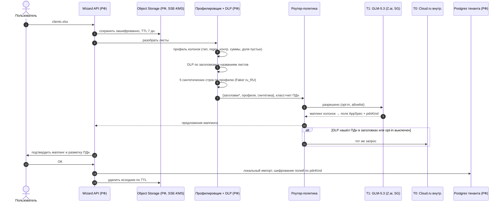

# Граница данных и фронтир-уровень моделей (30.09.2026)

> Кабинетное исследование по открытым источникам, не юридическое заключение. Непроверенное помечено **[?]**. Курс для оценок — 95 ₽/$ **[?]**, плюс 22% НДС, который Wizard платит как налоговый агент по услугам иностранцев.

## Кратко

1. **Гипотеза основателя подтверждается.** Сборка (план, спека, UI, воркфлоу, код, тесты, аудит) по своей природе ПДн не требует. ПДн — это рантайм-данные созданных систем, импорт таблиц и поддержка. Во время сборки ПДн попадают в промпт случайно: пользователь вписал в бриф имя или телефон.
2. **Главная поправка: на внешнем уровне данные надо удалять, а не токенизировать.** По 152-ФЗ обезличенные (псевдонимизированные) данные остаются ПДн у того, кто держит таблицу соответствия. Значит, токен, отправленный за рубеж, — это трансграничная передача ПДн. Для построения спеки конкретный клиент не нужен, модели достаточно знать, что «у клиента есть телефон». Поэтому наружу уходит текст с **необратимыми плейсхолдерами без записи в хранилище токенов**. Обратимая токенизация остаётся внутри РФ: для логов, T0 и отладки.
3. **Законно обслуживать компанию из РФ по собственным условиям могут только китайские провайдеры.** Z.ai, Moonshot и DeepSeek не называют Россию среди запрещённых регионов. У Anthropic, OpenAI и Google России в списках нет, xAI, по вторичным данным, Россию не обслуживает. Наилучший T1 — **Z.ai (GLM-5.3)**: сингапурское юрлицо, API-контент не хранится и не идёт в обучение.
4. **Разрыв с фронтиром небольшой.** На закрытой части SWE-Bench Pro v2 у Claude Opus 5 — 81.6%, у Kimi K3 — 78.7%, у GLM-5.3 — 77.6% **[?: методика]**. Веса GLM-5.3 и Kimi K3 открыты, поэтому **со временем T1 можно перенести внутрь РФ**: через Cloud.ru или свой инференс.
5. **T1 не дороже T0.** Средняя сборка на GLM-5.3 стоит ~50–75 ₽, на миксе A (T0) — ~96 ₽. Слой DLP добавляет <0.2 с к вызову и копейки к себестоимости. Трудозатраты на ядро — **12–17 дней**, с шифрованием полей — 15–22.

## Таблица решений

| # | Решение | Рекомендация |
|---|---|---|
| 1 | Что пускать на внешние модели | Только вызовы класса «нет ПДн» после DLP и необратимой редакции. Рантайм, импорт значений и поддержка с записями — всегда T0 |
| 2 | Токенизация или редакция на внешней границе | Редакция. Токены с хранилищем — только внутри РФ |
| 3 | T1-провайдер | Z.ai GLM-5.3 — основной. Moonshot K3 — после договора, запрещающего обучение на данных. DeepSeek — только «нет ПДн», и то с оговорками |
| 4 | Claude/GPT через Cloud.ru | Нет: противоречит правилам поддерживаемых регионов самих провайдеров. Адаптер держим провайдеро-независимым |
| 5 | Включение | Opt-in на уровне компании, отдельная галочка, выключатель на уровне тенанта |
| 6 | Страховка на случай пропуска ПДн | Уведомление РКН о трансграничной передаче в КНР и Сингапур (обе страны в «адекватном» перечне) — только для данных собственных пользователей Wizard |
| 7 | Стратегия | Просить Cloud.ru сделать GLM-5.3 и Kimi K3 внутренними; при MRR ≥ ~3–5 млн ₽ — свой инференс в РФ |

---

## 1. Классификация вызовов LLM по ПДн

| Тип вызова | Экспозиция ПДн | Что видит модель | Уровень |
|---|---|---|---|
| Интервью (живой чат) | **Случайная**: имена сотрудников и клиентов, телефоны в брифе | Сырой ввод пользователя | T0. На T1 — только после DLP |
| План, карточка системы | Случайная, унаследованная из интервью | Отредактированный транскрипт | T1 |
| Операции над AppSpec | **Нет** | Схема, роли, страницы | T1 |
| Код функций и коннекторов | **Нет**, если используются схемы API и синтетические payload | Спека, SDK, документация. Секреты — только ссылками | T1. Отладка на реальном вебхуке amoCRM — T0 |
| QA, генерация тестов, seed | Нет: seed синтетический | Спека, критерии приёмки | T1 |
| Аудит G4 | Нет | Спека, диф кода | T1 (другое семейство моделей) |
| AI-функции в рантайме систем клиента | **Неотъемлемая**. Оператор — клиент, Wizard — обработчик | Записи БД клиента | **Только T0** |
| Импорт Excel, маппинг | Неотъемлемая в значениях, **нет** в схеме | Заголовки, профили колонок, синтетические строки | Маппинг — T1, значения — только локально |
| Поддержка, отладка с реальными записями | Неотъемлемая | Записи, логи | **Только T0**. На T1 — стек-трейс без значений |
| Eval-стенд | Нет: брифы обезличиваются | — | T1 |

Вывод: по токенам ~85–90% сборки [?: замерить] приходится на класс «нет ПДн». Это ровно та часть, где качество модели важнее всего.

## 2. Слой «граница данных»

**Компоненты** (всё в РФ, Cloud.ru):

1. **Разметка в AppSpec** (уже в плане). У `entities[].fields[]` есть `pdnCategory` (none / обычные / спец / биометрия) и `pdnKind` (fio, phone, email, address, passport, snils, inn, card, free_text). Разметка задаёт правила редакции в рантайме и в логах.
2. **Входной DLP** — на каждом промпте, загрузке и ответе инструмента, перед роутером.
   - **Регулярки с контрольными суммами:** телефон +7/8; email; ИНН 10/12 с контрольным числом; СНИЛС с контрольной суммой; паспорт РФ (4+6); карта по Луну; счёт и БИК; ОГРНИП.
   - **NER:** [Natasha](https://github.com/natasha/natasha) (MIT) для PER/LOC/ORG, морфологии и адресов (экстракторы на Yargy, MIT). Модель spaCy `ru_core_news` обучена на Nerus из Natasha ([natasha-spacy](https://github.com/natasha/natasha-spacy)).
   - **Оркестрация:** [Presidio](https://github.com/microsoft/presidio) (MIT) — анализатор с движком spaCy/Stanza ([docs](https://github.com/microsoft/presidio/blob/main/docs/analyzer/nlp_engines/spacy_stanza.md)) и своими распознавателями. DeepPavlov NER — как второй голос при спорных срабатываниях. Для v0.1 он избыточен.
   - **Политика при сомнении:** спецкатегории (здоровье и т. п.) и паспорт/СНИЛС → вызов принудительно уходит на T0.
3. **Редакция и псевдонимизация.**
   - **Для T1** — необратимые типизированные плейсхолдеры в пределах вызова: `[ФИО_1]`, `[ТЕЛ_1]`. Соответствие живёт только в памяти запроса и не сохраняется. Русская морфология ломает суррогатные ФИО («Иванову»), а плейсхолдеры модели не склоняют.
   - **Для T0, логов и отладки** — обратимые токены. HMAC-SHA256 с ключом тенанта даёт стабильность внутри тенанта. Хранилище — отдельная схема Postgres с шифрованием значений.
   - **FPE** (FF1 по [NIST SP 800-38G](https://csrc.nist.gov/pubs/sp/800/38/g/upd1/final); FF3 из второй редакции исключён, [NIST](https://www.nist.gov/news-events/news/2025/02/methods-format-preserving-encryption-comment-second-public-draft-sp-800-38g)) — только там, где нужен валидный формат в тестовых фикстурах. В v0.1 проще синтетика.
4. **Шифрование полей** в рантайме — для `passport`/`snils`/`card`. Схема envelope: DEK на тенанта, KEK в [Cloud.ru KMS](https://cloud.ru/docs/kms/ug/index) (HSM, AES-256) или Yandex KMS. Поиск по полю — через blind index (HMAC).
   - HashiCorp Vault с 2023 года под BSL, поэтому берём **OpenBao** (MPL-2.0, Linux Foundation) ([обзор](https://bespinian.io/en/blog/openbao-os-vault-alternative/)).
   - Если модель угроз опирается на шифрование как на меру защиты, может потребоваться сертифицированное СКЗИ (приказ ФСБ № 378) **[?: юрист]**.
5. **Синтетика вместо реальных строк.** Faker/Mimesis `ru_RU` генерирует данные по профилю колонки: тип, формат, кардинальность, доля пустых.
6. **Реидентификация только в РФ.** Ответ модели проходит обратную подстановку токенов на T0-пути. От T1 возвращаются только спека и код, подставлять в них нечего.
7. **Логи.** Промпты хранятся только в отредактированном виде, 30 дней, в РФ. Доступ к хранилищу токенов — под аудитом. Решение роутера логируется без payload: тип вызова, класс, уровень, провайдер, версия политики.
8. **Роутер-политика** (policy-as-code, таблица в TS, по умолчанию «запрещено»). Решение = f(тип вызова, класс данных из DLP и AppSpec, opt-in тенанта, allowlist провайдеров с датой проверки условий, режим «только РФ»). При ошибке или неизвестном классе → T0. Если провайдер недоступен, автоматический фолбэк на T0.

**Импорт Excel с клиентами → маппинг в спеку** (значения не покидают РФ):

*Заголовки с найденными ПДн заменяются на `col_7`. Свободнотекстовые колонки описываются только как «free_text, средняя длина N».*

## 3. Право: 152-ФЗ

- **Обезличенные данные остаются ПДн.** Ст. 3 п. 9 определяет обезличивание как действия, после которых принадлежность данных субъекту нельзя определить «без использования дополнительной информации». Российская практика и РКН считают такие данные персональными, в отличие от анонимизации по GDPR ([b-152](https://b-152.ru/obezlichivanie-po-russki), [CISOClub](https://cisoclub.ru/obezlichivanie-po-russki-chem-nash-podhod-otlichaetsja-ot-evropejskoj-anonimizacii)).
- **233-ФЗ от 08.08.2024 (в силе с 01.09.2025).**
  - Ст. 13.1: по запросу Минцифры оператор обезличивает ПДн и передаёт их в ГИС (ЕИП НСУД).
  - Обезличивание спецкатегорий и биометрии запрещено ([anti-malware](https://www.anti-malware.ru/analytics/Technology_Analysis/Depersonalization-of-personal-data-in-Russia-2025), [Хабр](https://habr.com/ru/articles/931348/)).
  - Методы и правила утверждены [ПП № 1154 от 01.08.2025](https://www.consultant.ru/document/cons_doc_LAW_511607/) (в силе с 01.09.2025, заменило приказ РКН № 996 **[?]**). Методы: введение идентификаторов с таблицей соответствия, изменение состава и семантики, декомпозиция, перемешивание. Таблицы соответствия хранятся **отдельно**, совместное хранение запрещено ([Гарант](https://www.garant.ru/news/1840175/)). Хранилище токенов Wizard должно это соблюдать: отдельная схема, ключи и роли.
- **Токен за рубежом = трансграничная передача ПДн** (консервативная трактовка). Аргумент «у получателя нет ключа, значит это не ПДн» РКН не принимает **[?]**. Нужно:
  - уведомить РКН до начала передачи и собрать сведения о получателе ([ст. 12](https://www.consultant.ru/document/cons_doc_LAW_61801/e4ebbe1780de623c7cf32a59ca82a7bb523a25dd/));
  - в «адекватные» страны передавать можно после уведомления.
  - **КНР и Сингапур** входят в перечень [приказа РКН № 128](https://asta74.ru/article/perechen-gosudarstv) (раздел стран, не участвующих в Конвенции). [265-ФЗ от 26.07.2026](https://rkn-ok.ru/baza-znanij/fz-265-transgranichnaya-peredacha-2026) убрал из критерия ссылку на участие в Конвенции, перечень пока действует и может быть пересмотрен.
- **Данные клиентов Wizard — отдельная проблема.** В их системах оператором является клиент, поэтому трансграничную передачу пришлось бы уведомлять каждому клиенту. Практически это закрывает T1 для любых рантайм-ПДн, даже токенизированных.
- **Ст. 18 ч. 5 (в ред. 23-ФЗ, с 01.07.2025)** запрещает запись и хранение ПДн граждан РФ в БД за рубежом ([Консультант](https://www.consultant.ru/document/cons_doc_LAW_61801/cbf4e15b7c330f9372e876cdf2bc928bad7950ef/)). Провайдер, который **хранит** промпты (DeepSeek хранит в КНР), становится такой БД. Даже уведомление не спасает, поэтому для DeepSeek допустим только класс «нет ПДн».
- **Данные без ПДн** (спека, код, схема, синтетика) 152-ФЗ не регулирует. Остаются:
  - договорная конфиденциальность: описание процесса может быть коммерческой тайной клиента, отсюда пункт в оферте и opt-in;
  - 243-ФЗ: с 01.03.2027 Правительство может определить случаи, когда разрешены только суверенные модели. Нужен режим «только РФ» на тенанта.
- **Необратимая редакция** не даёт «дополнительной информации». Результат не ПДн, если в остатке нет косвенных идентификаторов. Для случая пропуска DLP уведомление по ст. 12 — страховка для данных собственных пользователей.

## 4. Провайдеры: кто законно обслуживает РФ

| Провайдер | Россия по условиям | Оплата из РФ | Флагман, цена за 1M, $ | Независимая оценка | Данные и обучение | Страна обработки |
|---|---|---|---|---|---|---|
| **Z.ai** (JINGSHENG HENGXING, Сингапур) | **Разрешена**: в [ToU](https://docs.z.ai/legal-agreement/terms-of-use) запрещены только Иран, КНДР, Куба, Крым, ДНР, Запорожье | Карты РФ не проходят; нужен агент или зарубежное юрлицо **[?]** | GLM-5.3: 1.4 / кэш 0.26 / 4.4 ([pricing](https://docs.z.ai/guides/overview/pricing)) | SWE-Pro v2 private 211/272 ([Scale](https://labs.scale.com/blog/swe-bench-pro-v2)) | API-контент не хранится и не идёт в обучение ([privacy](https://docs.z.ai/legal-agreement/privacy-policy)) | Сингапур |
| **Moonshot** (Moonshot AI PTE, Сингапур) | **Разрешена**: запрет только для стран под всеобъемлющими санкциями ([ToS](https://platform.kimi.ai/docs/agreement/modeluse)) | То же **[?]** | Kimi K3: 3 / 0.3 / 15 ([pricing](https://platform.kimi.ai/docs/pricing/chat)) | SWE-Pro v2 214/272; AA Index 57, 4-е место ([обзор](https://trilogyai.substack.com/p/kimi-k3-is-live-pricing-benchmarks)) | **Может обучаться на контенте**, исключение — по отдельному договору | Не указано **[?]** |
| **DeepSeek** (Ханчжоу) | Разрешена (та же формула) ([ToS](https://cdn.deepseek.com/policies/en-US/deepseek-open-platform-terms-of-service.html)); право КНР | Alipay, PayPal, карты; через посредников ([РБК](https://companies.rbc.ru/news/0Su2q3GJoP/kak-oplatit-deepseek-api-iz-rossii-v-2026-godu-popolnenie-balansa/)) | V4-Pro-0813: 1.32 / 3.96 в пик, вне пика ×0.5 ([pricing](https://api-docs.deepseek.com/quick_start/pricing)) | Независимых данных по V4 нет **[?]** | **Хранит в КНР**, обучение с opt-out ([privacy](https://cdn.deepseek.com/policies/en-US/deepseek-privacy-policy.html)) | КНР |
| **Alibaba Model Studio** (Intl) | Прямого запрета не нашёл **[?]** | **[?]** | Qwen3.8-Max, цена **[?]**; Qwen 4 анонсирован, но не выпущен | — | Данные «в выбранном регионе» ([regions](https://www.alibabacloud.com/help/en/model-studio/regions)) | Сингапур / Франкфурт |
| **MiniMax** | Условия API не удалось прочитать **[?]** | **[?]** | M3: 0.30 / 1.20 ([pricing](https://platform.minimax.io/docs/guides/pricing-paygo)) | — | **[?]** | — |
| **Mistral** (ЕС) | Прямо не запрещена, но санкции ЕС ([ToS](https://legal.mistral.ai/terms/commercial-terms-of-service), [ст. 5n 833/2014](https://finance.ec.europa.eu/document/download/6eb8bd33-992d-4b9d-8e17-baffef83aa35_en?filename=faqs-sanctions-russia-software_en%2C.pdf)) **[?]** | Практически нет | — | — | Обучение только по opt-in | ЕС |
| **Anthropic** | **Нет** в [списке](https://www.anthropic.com/supported-countries), плюс оговорка о владельцах из неподдерживаемых стран | — | — | — | — | — |
| **OpenAI** | **Нет**; «accessing or offering access» вне списка → блокировка ([список](https://developers.openai.com/api/docs/supported-countries)) | — | — | — | — | — |
| **Google Gemini** | **Нет** в [списке](https://ai.google.dev/gemini-api/docs/available-regions) | — | — | — | — | — |
| **xAI** | Недоступен в РФ «из-за санкций», по [вторичным данным](https://x.com/grok/status/1965450653750476820) **[?]** | — | — | — | — | — |

**Cloud.ru, «внешние» модели.** По п. 4.12 условий Cloud.ru — «исключительно лицо, обеспечивающее техническую маршрутизацию». Запросы уходят провайдеру, риски ПДн на заказчике, SLA нет ([условия](https://cloud.ru/documents/contracts/terms-of-service/evolution/foundation-models/description-foundation-models)). Для Claude и GPT это ничего не меняет: конечные пользователи и компания находятся в РФ, а это противоречит правилам регионов Anthropic и OpenAI **при любом реселлере**. Поэтому Wizard такие модели не включает.

Китайские внешние модели Cloud.ru (GLM-5.2, DeepSeek-V4-Flash, [каталог](https://cloud.ru/docs/foundation-models/ug/topics/overview__available__models)) могли бы дать T1 за рубли с закрывающими документами. Но нужно выяснить, **через кого** они маршрутизируются: напрямую к Z.ai/DeepSeek или через агрегатора из США **[?]**.

**Независимые бенчмарки.** Прогон Scale от 22.09.2026 по SWE-Bench Pro v2, закрытая часть: Opus 5 — 222/272, K3 — 214, GLM-5.3 — 211. Но обвязки у моделей разные **[?]**. Artificial Analysis измерил K3 на Terminal-Bench 2.1: 85% против 88.3% по данным вендора ([обзор](https://trilogyai.substack.com/p/kimi-k3-is-live-pricing-benchmarks)). Цифры GLM-5.3 по TB известны только от вендора.

**Открытые веса.** Опубликованы GLM-5.3 (753B, 28.08.2026, своя лицензия; ограничение только для компаний с выручкой > $10 млрд, [The New Stack](https://thenewstack.io/zai-glm-weights-license/)) и Kimi K3 (2.8T, 27.07.2026, отдельный договор нужен MaaS с выручкой > $20 млн, [HF](https://huggingface.co/moonshotai/Kimi-K3)). Для Wizard обе лицензии допустимы. GLM-5.3 в FP8 помещается на один узел 8×H200 (1.8–3.8 млн ₽/мес, см. [аудит 01](../audit/01-llm-access-and-costs.md#a6-gpu-в-рф)).

## 5. Уровни, стоимость, трудозатраты

| Уровень | Модели | Данные | Вызовы |
|---|---|---|---|
| **T0** (по умолчанию) | Cloud.ru внутренние: GLM-5.1, Kimi-K2.6, DeepSeek-V4-Pro, MiniMax-M3; Yandex; позже GLM-5.3/K3 внутри РФ | Любые | Интервью, рантайм-AI, импорт значений, поддержка, всё с паспортом/СНИЛС/спецкатегориями, все фолбэки |
| **T1** (opt-in) | Z.ai GLM-5.3; Moonshot K3 после договора без обучения; DeepSeek V4-Pro только для синтетики и кода | Только «нет ПДн» после DLP и редакции | План, операции AppSpec, код, QA, аудит G4, маппинг импорта, eval |
| **T2** | Mistral, Alibaba, MiniMax — после проверки условий юристом. Anthropic, OpenAI, Google, xAI — выключены, пока их условия не допускают РФ | Как T1 | Как T1 |

**Стоимость** (с НДС агента, ₽ за 1M, вход / выход):

| Модель | Цена | Средняя сборка, 320k токенов |
|---|---|---|
| GLM-5.3 | 162 / 510, кэш 30 | ~74 ₽; ~50 ₽ при 70% попаданий в кэш |
| Kimi K3 | 348 / 1 739 | ~200 ₽; ~145 ₽ с кэшем |
| T0, микс A (для сравнения) | — | 96 ₽ |

Сверху — комиссия платёжного агента 3–10% **[?]**.

**Накладные расходы DLP:**
- Natasha/Presidio на CPU — ~20–100 мс на вызов, хранилище токенов — 1–3 мс, сеть до Сингапура — +150–250 мс RTT **[?]**. На фоне секунд генерации это <5%.
- Под DLP (2 vCPU) — ~3–6 тыс. ₽/мес **[?]**, то есть <1% себестоимости LLM.

**Трудозатраты соло-основателя:**

| Работа | Дни |
|---|---|
| Классификация вызовов, роутер-политика, allowlist с датой проверки условий, фолбэк | 2–3 |
| DLP v1: регулярки с контрольными суммами, Natasha, обёртка Presidio, корпус из 200 примеров для замера полноты | 4–6 |
| Редакция и хранилище токенов (отдельная схема, HMAC-ключи из KMS, TTL) | 2–3 |
| Импорт Excel: профиль, синтетика, маппинг, локальный импорт | 3–4 (частично нужен и так) |
| Логи, аудит доступа | 1 |
| Шифрование полей: envelope + blind index (можно отложить) | 3–5 |
| **Итого** | **12–17**, с шифрованием полей 15–22 |

К этому добавляются юрист (уведомление по ст. 12, текст согласия, пункт оферты), 1–2 дня и ожидание.

**Порядок:** сначала eval — 30 брифов на T0 (GLM-5.1) против T1 (GLM-5.3), и только если разрыв заметен, строить слой.

## 6. Вопросы основателю

1. Чем измеряется «посредственно»? Есть ли цифры eval, где GLM-5.1/K2.6 проваливают G0–G2, а GLM-5.3 проходит? Без них слой — это 2–3 недели на гипотезу.
2. Согласны ли вы, что рантайм-AI, импорт значений и поддержка с записями **навсегда** остаются на T0, даже для opt-in клиентов?
3. Кто юридически платит Z.ai и Moonshot: зарубежное юрлицо, платёжный агент, Cloud.ru? Как это ляжет на валютный контроль и НДС агента?
4. Уведомление РКН о передаче в КНР и Сингапур публично. Не противоречит ли оно позиционированию «данные в РФ» и доверию ремонтных компаний?
5. Какой уровень пропусков DLP вы принимаете (например, полнота ≥ 98% на корпусе), и что делать при инциденте, когда ПДн ушли на T1?
6. Если завтра Z.ai добавит РФ в список запрещённых (как OpenRouter в мае), устраивает ли вас автоматический откат на T0 без предупреждения пользователя?
7. При каком MRR вы готовы платить 2–4 млн ₽/мес за свой GLM-5.3 в РФ, чтобы закрыть вопрос T1 целиком? Или сначала просить Cloud.ru сделать его внутренней моделью?
8. Допускаете ли вы DeepSeek, который хранит данные в КНР и обучается на них по умолчанию, хотя бы для кода без ПДн? Описание процесса клиента может быть его коммерческой тайной.
9. Opt-in — на компанию или на каждую сборку? Что видит пользователь, который отказался: «сборка на российских моделях, качество ниже»?
10. С 01.03.2027 могут появиться случаи «только суверенные модели» (243-ФЗ). Готов ли режим «только РФ» как тарифная опция, а не как исключение?
