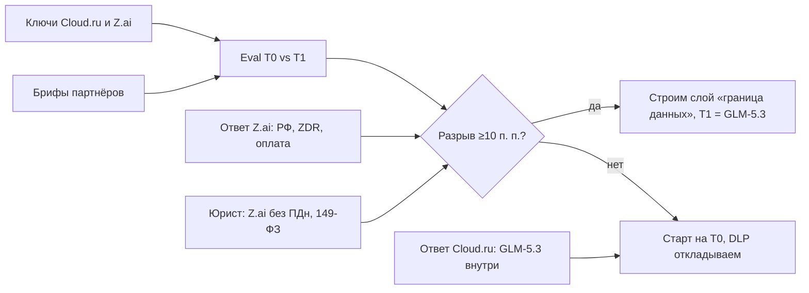

# Неделя 0: чек-лист

Цель недели — снять пять неизвестных до начала разработки: какая модель собирает (T0 или T1), что даёт Cloud.ru, правовой статус, договор и оплата Z.ai, название. Плюс дизайн-партнёры. Основа — [концепция v3.1](../concept.md), §3.4, §6, §8.

**Основатель делает только то, что требует его подписи, денег, аккаунта или личных контактов.** Всё остальное готовит агент.

## Задачи

| # | Задача | Кто | Статус | Что нужно от основателя |
|---|---|---|---|---|
| 1 | Eval-стенд: бриф → AppSpec, GLM-5.1 (Cloud.ru, T0) против GLM-5.3 (Z.ai, T1) | агент | ✅ стенд готов, dry-run проходит ([tools/eval](../../tools/eval/README.md)); 12 брифов из 30 | ключи `CLOUDRU_API_KEY` и `ZAI_API_KEY` (см. ниже) |
| 1a | Боевой прогон и отчёт «T1 оправдан или нет» | агент | ⏳ ждёт ключей | — |
| 1b | Добрать брифы до 30 из брифов партнёров | агент | ⏳ ждёт брифов (п. 6) | — |
| 2 | Вопросы в Cloud.ru: лимиты FM, json_schema, кэш, SLA, GLM-5.3 внутри РФ, PostgreSQL, Kubernetes, аттестат, поручение, S3, KMS | агент → основатель | ✅ текст готов: [cloudru-questions.md](cloudru-questions.md) | вписать реквизиты и отправить тикет из ЛК; переслать ответ |
| 3 | Юрист: 149-ФЗ, ОРИ, цепочка 152-ФЗ, Z.ai без ПДн, оферта, НДС, ЮKassa, оплата Z.ai | агент → основатель | ✅ бриф готов: [lawyer-brief.md](lawyer-brief.md) | выбрать юриста из 2–3 кандидатов, согласовать цену (50–150 тыс. ₽), оплатить, провести вводный созвон |
| 4 | Z.ai: страна, отсутствие хранения и обучения (DPA), договор, лимиты, вывод моделей, оплата | агент → основатель | ✅ письмо готово: [zai-contract.md](zai-contract.md) | отправить с корпоративной почты; переслать ответ |
| 4a | Moonshot (Kimi K3): договор о запрете обучения | агент → основатель | ✅ записка готова, там же | отправить (не блокирует старт) |
| 5 | Названия: шорт-лист из 8, домены, очевидные конфликты | агент | ✅ предварительно: [naming-check.md](naming-check.md) | выбрать 3 финалиста; при желании купить свободные домены |
| 5a | Поиск по ФИПС для 3 финалистов | основатель или поверенный | ⏳ после выбора | доступ к ИПС ФИПС или 5–15 тыс. ₽ на поверенного [?] |
| 6 | 6–8 дизайн-партнёров: 3–4 из ивентов, 3–4 из товаров на заказ, по 3 брифа без ПДн | основатель | ⏳ | написать контактам (текст ниже), собрать брифы; агент переведёт их в формат eval |
| 7 | Соглашение с дизайн-партнёром (NDA + год «Бизнеса» + использование брифов) | юрист | ⏳ входит в п. 3 | — |

## Что нужно от основателя (всё в одном месте)

1. **Реквизиты:** ООО или ИП, ИНН, налоговый режим (УСН или ОСН), ОКВЭД. Они нужны для тикета Cloud.ru, письма Z.ai и брифа юристу.
2. **Ключ Cloud.ru Foundation Models:** аккаунт Evolution на юрлицо → сервисный аккаунт → API-ключ. Бюджет на eval — меньше 500 ₽ на 30 брифов.
3. **Ключ Z.ai:** регистрация на z.ai и пополнение на $10–20. Российские карты не проходят, поэтому для eval нужен любой законный разовый способ. Как платить постоянно, решаем через юриста и ответ Z.ai. Если способа нет, eval идёт на T0 плюс внешняя модель Cloud.ru GLM-5.2 как ориентир T1 (брифы без ПДн): `node tools/eval/run.mjs --models=glm-5.1,ext-glm-5.2`.
4. **Отправить** тикет в Cloud.ru и письма в Z.ai и Moonshot; ответы переслать агенту.
5. **Выбрать и нанять юриста** по брифу.
6. **Написать 6–8 партнёрам** и собрать по 3 брифа.
7. **Выбрать 3 названия** из восьми.

Ключи передавать через переменные окружения или менеджер секретов, не в чат и не в репозиторий. Для ночного live-eval в CI те же ключи кладутся в GitHub Actions Secrets. Имена и порядок описаны в [docs/ops/eval.md](../ops/eval.md).

## Текст для дизайн-партнёров (можно отправить как есть)

> Привет! Делаю сервис, где рабочую систему (регистрацию на мероприятие, приём заказов, внутренние заявки) собирают по описанию в чате, без программистов. Ищу 6–8 компаний для закрытой беты: в обмен на год бесплатного тарифа «Бизнес» прошу 3 описания реальных задач (без имён и телефонов клиентов), созвон раз в две недели и одно реальное мероприятие или продажу через систему в бете. Интересно?

## Порядок и зависимости

**Правило решения по T1:** GLM-5.3 должен быть лучше GLM-5.1 на ≥10 п. п. по валидности с первой попытки и по скору, а Z.ai должна письменно подтвердить работу с РФ и отсутствие хранения. Иначе стартуем на T0 и экономим 12–17 дней на слое DLP.
